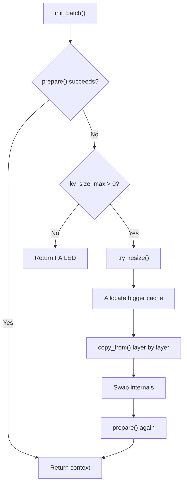

## From 8 GB Upfront to 16 MB on Demand

In the [previous post](/posts/demand-paging-fails-apple-silicon-gpu/), I discovered that Metal GPU buffers commit all physical pages at creation time — OS-level demand paging doesn't work. The only way to save memory is to **allocate smaller buffers and grow them**.

This post covers the implementation, the optimizations that made it practical, and the benchmark results.

## How It Works

The idea is straightforward:

1. **Start small** — allocate a KV cache with 256 cells instead of the full context size
2. **Grow on demand** — when `init_batch()` fails because the cache is full, call `try_resize()` to allocate a bigger cache, copy existing data, and retry
3. **Re-reserve the scheduler** — after `init_batch()` triggers a resize, `llama_context` notices the resize flag and re-reserves compute buffers before graph execution



The `--kv-dynamic` flag enables this. When disabled, behavior is identical to upstream `llama.cpp`.

### The try_resize() Implementation

The core of the resize is a create-copy-swap pattern:

```cpp
bool llama_kv_cache::try_resize() {
    // calculate new size with growth strategy
    uint32_t new_size = calculate_growth(kv_size_cur);

    // create a temporary cache with the new size;
    // kv_size_max=0 disables the "start at 256" logic for the temp cache
    llama_kv_cache tmp(model, saved_type_k, saved_type_v, ...
                       new_size, ... /* kv_size_max = */ 0);

    // copy existing data layer by layer
    tmp.copy_from(*this);

    // steal the internals
    ctxs_bufs = std::move(tmp.ctxs_bufs);
    layers    = std::move(tmp.layers);
    v_cells   = std::move(tmp.v_cells);
    v_heads   = std::move(tmp.v_heads);
}
```

When `tmp` goes out of scope, the old (smaller) buffers are freed. The cache now has a bigger backing store with all existing KV data preserved.

### Layer-by-Layer, Stream-by-Stream Copy

The `copy_from()` method copies tensor data through a CPU staging buffer one layer at a time, and one stream view at a time:

```cpp
void llama_kv_cache::copy_from(const llama_kv_cache & other) {
    for (size_t il = 0; il < layers.size(); ++il) {
        for (size_t s = 0; s < other.layers[il].k_stream.size(); ++s) {
            std::vector<uint8_t> staging(ggml_nbytes(other.layers[il].k_stream[s]));
            ggml_backend_tensor_get(other.layers[il].k_stream[s], staging.data(), 0, staging.size());
            ggml_backend_tensor_set(layers[il].k_stream[s], staging.data(), 0, staging.size());
        }

        // same pattern for V stream views
    }
}
```

This is critical for memory efficiency. A naive approach would allocate the new cache and copy the whole KV region in one shot. The current code limits the staging buffer to one layer/stream view at a time.

The current version also keeps KV buffers zero-initialized. The memory savings come from starting with a much smaller cache, not from leaving padding or future rows uninitialized.

## Growth Strategy: The 4→8 GB Jump Problem

My first implementation used simple doubling: 256 → 512 → 1K → 2K → ... → 64K → 128K.

The problem is what happens at large sizes:

```
Doubling:   ... → 32K (2 GB) → 64K (4 GB) → 128K (8 GB) → 💥 GPU OOM
                                              ↑
                                         4 GB jump!
```

On a 32 GB system with a 27B model (~16 GB), the available RAM for KV cache is ~6-7 GB. A 4→8 GB jump overshoots and crashes immediately.

The fix: **linear-ish growth after a small-cache phase.**

```
Doubling + Linear:
  ... → 32K (2 GB) → 49K (3 GB) → 65K (4 GB) → 81K (5 GB) → 98K (6 GB)
                     ↑ +1 GB       ↑ +1 GB      ↑ +1 GB      ↑ +1 GB
```

The current implementation uses a simple heuristic:

```cpp
if (kv_size_cur < 4096) {
    new_size = kv_size_cur * 2;
} else {
    const size_t total = total_size();
    const size_t per_cell = total / kv_size_cur;
    const uint32_t cells_per_gb =
        per_cell > 0 ? (uint32_t) (1024ULL * 1024 * 1024 / per_cell) : kv_size_cur;
    new_size = kv_size_cur + std::max(cells_per_gb, 256u);
}
```

So the switch point is currently a fixed `4096` cells. The "+1 GB" step is still derived from the model's actual current KV footprint, but the threshold itself is just a heuristic.

## The Hybrid Model Gotcha

Qwen3.5-27B uses a **hybrid architecture** — 16 attention layers and 64 recurrent (SSM) layers. These are managed by `llama_memory_hybrid`, which internally wraps a `llama_kv_cache` for attention and a `llama_memory_recurrent` for SSM state.

My initial implementation only added dynamic resize to the standalone `llama_kv_cache` path. Hybrid models take a different code path through `llama_memory_hybrid`, so the dynamic parameters weren't forwarded:

```cpp
// Before: hybrid path didn't forward kv_dynamic
res = new llama_memory_hybrid(model, type_k, type_v, ...
                              offload, unified,
                              filter_attn, filter_recr);

// After: forward kv_size_max into the attention KV cache path
res = new llama_memory_hybrid(model, type_k, type_v, ...
                              offload, unified,
                              filter_attn, filter_recr,
                              cparams.kv_dynamic ? cparams.n_ctx_seq : 0);
```

The hybrid model's `init_batch()` also needed its own retry logic:

```cpp
auto heads_attn = mem_attn->prepare(ubatches);
while (heads_attn.empty()) {
    if (!mem_attn->try_resize()) {
        break;
    }
    heads_attn = mem_attn->prepare(ubatches);
}
```

## Benchmark Results: Vanilla vs Dynamic

Hardware: **Apple M4 Mac Mini, 32 GB unified memory**  
Model: **Qwen3.5-27B Q4_K_M** (hybrid architecture)  
Context: **131,072 tokens** (`-c 131072`)

### Vanilla (8 GB KV cache allocated upfront)

| Prompt Tokens | Gen t/s | RSS (MB) | KV (MB) | Status |
|:---:|:---:|:---:|:---:|:---:|
| 89 | 4.34 | 24,474 | 8,192 | ✅ (1 success out of 5 runs) |
| 809 | — | 10,765 | 8,192 | ❌ GPU OOM |
| 6,409 | — | 24,421 | 8,192 | ❌ GPU OOM |
| 25,609 | — | 24,458 | 8,192 | ❌ GPU OOM |
| 40,009 | — | 24,447 | 8,192 | ❌ GPU OOM |

**4 out of 5 tests crashed with `kIOGPUCommandBufferCallbackErrorOutOfMemory`.** Metal GPU buffers can't be swapped — when physical RAM runs out, the GPU crashes.

### Dynamic (start at 256 cells, grow on demand)

| Prompt Tokens | Gen t/s | RSS (MB) | KV (MB) | KV Cells | Resizes | GPU OOM |
|:---:|:---:|:---:|:---:|:---:|:---:|:---:|
| 89 | **4.66** | 16,145 | 16 | 256 | 0 | 0 |
| 809 | **4.66** | 16,197 | 64 | 1,024 | 2 | 0 |
| 6,409 | **4.47** | 16,464 | 512 | 8,192 | 5 | 0 |
| 25,609 | **3.78** | 17,322 | 2,048 | 32,768 | 7 | 0 |
| 40,009 | **3.27** | 18,413 | 3,072 | 49,152 | 8 | 0 |
| 64,009 | **2.65** | 19,514 | 4,096 | 65,536 | 9 | 0 |
| 80,009 | **2.32** | 19,002 | 5,120 | 81,920 | 10 | 0 |

**All 7 tests completed successfully. Zero GPU OOM. Zero swap (up to 64K tokens).**

### The Numbers That Matter

| Metric | Vanilla | Dynamic |
|--------|---------|---------|
| GPU OOM rate at 131K context | **80%** (4/5 crashed) | **0%** (7/7 stable) |
| Max usable tokens | ~89 (unreliable) | **80K+** |
| RSS at 89 tokens | 24,474 MB | 16,145 MB (**-8.3 GB**) |
| Swap at 1K tokens | +1,560 MB | 0 MB |

The TPS decrease from 4.66 (1K) to 2.32 (80K) is expected — it's caused by attention's O(n²) complexity scaling with context length, not by the dynamic resize mechanism.

## The Final Code

The current implementation is **215 insertions and 7 deletions** across 11 files:

```
 common/arg.cpp              |   7 +++
 common/common.cpp           |   1 +
 common/common.h             |   1 +
 include/llama.h             |   1 +
 src/llama-context.cpp       |  29 ++++++++++
 src/llama-cparams.h         |   1 +
 src/llama-kv-cache.cpp      | 133 +++++++++++++++++++++++++++++++++++++++++++-
 src/llama-kv-cache.h        |  26 ++++++++-
 src/llama-memory-hybrid.cpp |  13 ++++-
 src/llama-memory-hybrid.h   |   4 +-
 src/llama-model.cpp         |   6 +-
 11 files changed, 215 insertions(+), 7 deletions(-)
```

No custom GPU kernels. No new wrapper classes. No ggml modifications. Just growth logic inside the existing `llama_kv_cache` class, triggered automatically when the cache is full and `--kv-dynamic` is enabled.

## Try It

```bash
git clone https://github.com/rockyRunnr/llama.cpp
cd llama.cpp && git checkout feature/dynamic-kv-cache
cmake -B build -DGGML_METAL=ON && cmake --build build -j

./build/bin/llama-completion \
    -m your-model.gguf \
    -c 131072 \
    --kv-dynamic \
    -p "Your prompt here" -n 100
```

Watch the logs for `dynamic KV cache: start = 256 cells` and `resizing KV cache from X to Y cells`.

---

*This is part 3 of a 3-part series on KV cache optimization in llama.cpp. [Part 1](/posts/paged-attention-llama-cpp-deep-dive/) covers the initial architecture analysis. [Part 2](/posts/demand-paging-fails-apple-silicon-gpu/) covers the demand paging investigation and Metal discovery.*
